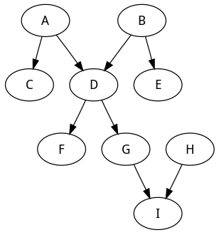

% Functional Programming and Data Science
% Wayne Chang (wayne@wyc.io)
% June 21st, 2017


# What is functional programming?


> "I know it when I see it"

>> Potter Stewart, U.S. Supreme Court Justice

Functional programming is a paradigm/style of programming that:

- Has no explicit definition.
- Avoids **side effects** and changing states.
- Favors **expressions** to statements.
- Gives functions **first-class** treatment.

# Example: Grading Tests

In Central New Jersey, you need a 90 or above to pass a test.

```python
# Statements
if grade > 90:
    passed = True
else:
    passed = False

# Expression
passed = grade > 90
```

# Example: Grading Tests Imperatively

We want to check passing status for many students:

```python
students = [
    ["John", 60],
    ["Sally", 95],
    # ...
]

# Statements 
for idx, s in enumerate(students):
    if s[1] > 90:
        s.append(True)
    else:
        s.append(False)

>>> students
[['John', 60, False], ['Sally', 95, True]]
```

# Example: Grading Tests Functionally

We want to check passing status for many students:

```python
students = [
    ["John", 60],
    ["Sally", 95],
    # ...
]

# Expressions
# Immutability: we do not change the list!
checked_students = map(
    lambda s: [s[0], s[1], s[1] > 90], students)
>>> list(checked_students)
[['John', 60, False], ['Sally', 95, True]]
```

# Example Takeaway

- Not only is functional programming often cleaner, but it also allows us to
  make meaningful data dependencies because the underlying values are
  unchanged.

- When you have states in your models, they are baked-in assumptions.

- In the statistical sciences, we like to make our assumptions as explicit as
  possible. Make it a brazen function parameter and not a sneaky local
  variable.

# Example Takeaway



# Example: Deltas

Return a list of differences between elements.

```python
lst = [0, 1, 1, 2, 3, 5, 8, 13, 21, 34, 55, 89]

# Imperative
output = []
for idx, val in enumerate(lst):
    if idx < len(lst) - 1:
        # Up until the 2nd-to-last elem
        output.append(lst[idx+1] - val)

# Functional
# Note: zip([1,2],['a','b']) is [(1,'a'),(2,'b')]
map(lambda x: x[0] - x[1], zip(lst[1:], lst))

```

# Example Takeaway

- Functional programming lets you think at the level of data, and not datums. It is an elegant brush stroke, not a clanky sewing machine.

- This means fewer chances to mess up, and code that more-closely resembles
  your high-level operations on data.


# The Future: Code is in KBs, Data is in TBs

- "Code moving to data" is embraced by Hadoop, Spark, Joyent, etc. It began
  with map/reduce, and functional programming is still heavily influencing its
  design.

- When code is stateless and treats functions like values, it becomes modular
  and composable.

```python
# original: map(lambda x: x[0] - x[1], zip(lst[1:], lst))
deltaList = (lambda lst: 
    map(lambda x: x[0] - x[1], zip(lst[1:], lst)))
deltaList([0, 1, 1, 2, 3, 5, 8, 13, 21, 34, 55, 89])
```

# Extra Credit: J KNN Example

Below is a k-nearest neighbor implementation in a functional programming language called J.

```j
NB. dyad takes two vectors, returns euclidean distance
dist =: [:%:[:|[:+/(*:@:-)
data =: 1 2 3,2 2 3,2 3 3,1 2 3,:2 3 4
query =: 1 2 3
k =: 3

k {."1 /:"1 query&dist"1 data
```

# References

Slides: https://github.com/wyc/fp-data-science

- [Moving the Code to the Data](http://personal.cac.rutgers.edu/TASSL/pdfs/data2.pdf)
- [Functional Programming in Python](https://www.ibm.com/developerworks/library/l-prog/index.html)
- [A Practical Introduction to Functional Programming](https://maryrosecook.com/blog/post/a-practical-introduction-to-functional-programming)
- [Lambda, filter, reduce, and map](http://www.python-course.eu/lambda.php)
- [Python3 Standard Library: functools](https://docs.python.org/3/library/functions.html)
- [Awesome Function Python Curated Content](https://github.com/sfermigier/awesome-functional-python)

# EOF
